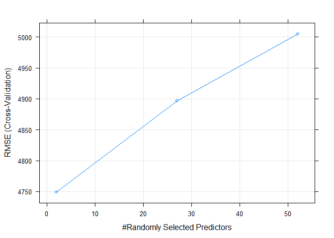

Project 2
================
Tommy King and Steph Camino
2022-06-30

``` r
library(tidyverse)
library(knitr)
library(gridExtra)
library(caret)
```

# Introduction

For this project, we’re going to be taking a look at news article
popularity data in the hopes of gaining some insight into the key
factors that lead to articles accumulating shares on social media. To
start out, we’re going to hone in on the Entertainment data channel to
do some exploration before automating our process for use with any of
the channels. In the Entertainment subset of the data, we’ll initially
take a look at the variables corresponding to the day of the week an
article was published on, as well as the number of words in the
title/body of the article and the number of images and videos included.

Once we’ve completed our exploratory analysis, we’ll select features
that we think would be a good fit in various types of models. We’ll
compare and evaluate the models we build on several metrics to decide
which model provides the most accurate forecasts of article popularity.

# Data

``` r
# URL for the Online News Popularity Data Folder
url <- "https://archive.ics.uci.edu/ml/machine-learning-databases/00332/OnlineNewsPopularity.zip"

# Creates two temporary files
temp <- tempfile()
temp2 <- tempfile()

# Downloads the zipped folder from the URL and saves it in temp
download.file(url, temp)

# Unzips temp and saves it in temp2
unzip(zipfile = temp, exdir = temp2)

# Reads in the data from temp2 and saves it as data
data <- readr::read_csv(file.path(temp2, "OnlineNewsPopularity/OnlineNewsPopularity.csv"))

# Unlinks our temporary files
unlink(c(temp, temp2), force = TRUE)
```

``` r
# Creates a new dataset "entertainment"
# Filters data for when the data channel is chosen
# Removes Variables that all start with data_channel_is_, url, and timedelta
# url and timedelta are non-predictive

# Added this variable for automation purposes
channel_selection <- paste0("data_channel_is_", params$type)

# Changed to our channel selection variable here
dataSubset <- data %>% as_tibble() %>%
  filter(!!as.symbol(channel_selection) == 1) %>%
  select(-c(url, timedelta, starts_with("data_channel_is_")))

# Creates a new character variable "day" that states what day it is. Derived from the binary variables for each day. 
# Factors the variable so we can use it as a categorical variable.
# Orders the factors in the order of the days of the week.
dataSubset2 <- dataSubset
dataSubset2$day <- ifelse(dataSubset$weekday_is_monday == 1, "Monday",
                            ifelse(dataSubset$weekday_is_tuesday == 1, "Tuesday",
                                   ifelse(dataSubset$weekday_is_wednesday == 1, "Wednesday",
                                          ifelse(dataSubset$weekday_is_thursday == 1, "Thursday",
                                                 ifelse(dataSubset$weekday_is_friday == 1, "Friday",
                                                        ifelse(dataSubset$weekday_is_saturday == 1, "Saturday",
                                                               ifelse(dataSubset$weekday_is_sunday == 1, "Sunday", "NA"))))))) %>%
                      as.factor() %>% 
                      ordered(levels = c("Monday", "Tuesday", "Wednesday", "Thursday", "Friday", "Saturday", "Sunday"))
```

# Summarizations

-   The first set of plots:

    -   When you look at the first set of plots, the plot in the upper
        left-hand corner is a histogram of shares. Here you can see the
        distribution of the response variable. Look out for potential
        skewness and potential outliers.

    -   The plot in the upper right-hand corner is a scatterplot for
        number of words in the title versus the number of shares it got.
        Here you can look at the relationship between the two variables.
        Watch out for any potential transformations that need to be made
        when modeling your linear regression models.

    -   The next plot is the middle left, it is a scatterplot of the
        number of words in the content versus the number of shares it
        got. Here you can look at the relationship between the two
        variables. Watch out for any potential transformations that need
        to be made when modeling your linear regression models.

    -   The middle right plot is a scatterplot of number of images
        versus the number of shares it got. Here you can look at the
        relationship between the two variables. Watch out for any
        potential transformations that need to be made when modeling
        your linear regression models.

    -   The scatterplot of number of videos versus number of shares it
        got is in the bottom left-hand corner. Here you can look at the
        relationship between the two variables. Watch out for any
        potential transformations that need to be made when modeling
        your linear regression models.

    -   The scatterplot in the bottom right-hand corner is the number of
        links versus the number of shares it got. Here you can look at
        the relationship between the two variables. Watch out for any
        potential transformations that need to be made when modeling
        your linear regression models.

-   The second set of plots:

    -   In the upper left-hand corner is a density plot of text
        subjectivity. Here a kernel density estimate was used to show
        the probability density function of the variable. Look out for
        potential skewness and potential data distributions here.

    -   In the upper right-hand corner is a density plot of text
        sentimental polarity. Here a kernel density estimate was used to
        show the probability density function of the variable. Look out
        for potential skewness and potential data distributions here.

    -   In the lower left-hand corner is a density plot of the rate of
        positive words in the content. Here a kernel density estimate
        was used to show the probability density function of the
        variable. Look out for potential skewness and potential data
        distributions here.

-   The final image:

    -   Here you can see a scatterplot for each day of the week of
        Number of words in the number of words in the content and number
        of shares it got. If there are big differences across the plots
        there may be an interaction effect between day of the week and
        number of words in the content.

``` r
# Histogram for shares
g <- ggplot(dataSubset, aes(x = shares)) + 
        geom_histogram(fill = "blue", binwidth = 5000) + 
        labs(x = "Shares", y = "Count", title = "Histogram of Shares")

# Scatterplot for n_tokens_title vs shares
g2 <- ggplot(dataSubset2, aes(x = n_tokens_title, y = shares)) + 
          geom_point() + 
          labs(x = "Number of Words in the Title", y = "Shares", title = "Title Word Count vs Shares") 

# Scatterplot for n_tokens_content vs shares
g3 <- ggplot(dataSubset2, aes(x = n_tokens_content, y = shares)) + 
          geom_point(color = "Green") + 
          labs(x = "Number of Words in the Content", y = "Shares", title = "Content Word Count vs Shares") 


# Added some new plots for number of images, videos and links vs. shares
g4 <- ggplot(dataSubset, aes(x = num_imgs, y = shares)) + geom_point(color = "Red") + labs(x = "Number of Images", y = "Shares", title = "Images vs Shares") 
g5 <- ggplot(dataSubset, aes(x = num_videos, y = shares)) + geom_point(color = "Aquamarine") + labs(x = "Number of Videos", y = "Shares", title = "Videos vs Shares") 
g6 <- ggplot(dataSubset, aes(x = num_hrefs, y = shares)) + geom_point(color = "Purple") + labs(x = "Number of Links", y = "Shares", title = "Links vs Shares") 

# We can move this up to where we have all the package info eventually but wanted to put it here for now
# Can put all of our scatter plots into a single grid so they're all lined up!
library(gridExtra)

grid.arrange(g, g2, g3, g4, g5, g6, ncol = 2, nrow = 3)
```

<!-- -->

``` r
# Looking into plotting some of the distributions of the more obscure variables
g7 <- ggplot(dataSubset, aes(global_subjectivity)) + 
  geom_density(kernel = "gaussian", color = "Coral", fill = "Coral", alpha = .5) + labs(y = "Density", x = "Text Subjectivity", title = "Density Plot: Text Subjectivity") 

g8 <- ggplot(dataSubset, aes(global_sentiment_polarity)) + 
  geom_density(kernel = "gaussian", color = "Blue", fill = "Blue", alpha = .5) + labs(y = "Density", x = "Text Sentimental Polarity", title = "Density Plot: Text Sentimental Polarity")

g9 <- ggplot(dataSubset, aes(global_rate_positive_words)) + 
  geom_density(kernel = "gaussian", color = "Green", fill = "Green", alpha = .5) + labs(y = "Density", x = "Rate of Positive Words in the Content", title = "Density plot: Positive Words")

# Plots a Boxplot of number of shares per day of the week
g10 <- ggplot(dataSubset2, aes(x = day, y = shares)) + 
          geom_boxplot(fill = "grey") + 
          labs(x = "Day of the Week", y = "Shares", title = "Boxplot of Shares per Day") +
          scale_x_discrete(labels = c("Monday" = "Mon", "Tuesday" = "Tue", "Wednesday" = "Wed", "Thursday" = "Thu", "Friday" = "Fri", "Saturday" = "Sat", "Sunday" = "Sun"))

grid.arrange(g7, g8, g9, g10, ncol = 2, nrow = 2)
```

<!-- -->

``` r
# Plot for every day of the week for Number of Words in the Content vs Shares
g11 <- ggplot(dataSubset2, aes(x = n_tokens_content, y = shares)) + 
          geom_point() + 
          facet_wrap(~ day) + 
          labs(x = "Number of Words in the Content", y = "Shares", title = "Content Word Count vs Shares for Every Day of the Week")
g11
```

<!-- -->

Below is a numerical summary for the response variable, number of
shares. Here you can see the minimum, average, median, maximum, and
variance. Here you can see the spread of the data and if the data is
skewed, if the average and median are drastically different.

``` r
# Calculates the minimum, average, median, maximum, and variance of Shares.
shareSum <- dataSubset %>% summarise(min = min(shares), avg = mean(shares), med = median(shares), max = max(shares), var = var(shares))

# Creates vector of summary statistic types.
word <- c("Minimum", "Average", "Median", "Maximum", "Variance")

# Prints out the summaries for Shares.
for(i in 1:5){
  print(paste0("The ", word[i], " of Shares is ", shareSum[i]))
}
```

    ## [1] "The Minimum of Shares is 5"
    ## [1] "The Average of Shares is 3629.38312526905"
    ## [1] "The Median of Shares is 2100"
    ## [1] "The Maximum of Shares is 122800"
    ## [1] "The Variance of Shares is 30516422.0943232"

Below is a numerical summary for test subjectivity. Here you can see the
minimum, average, median, maximum, and variance. Here you can see the
spread of the data and if the data is skewed, if the average and median
are drastically different.

``` r
# Calculates the minimum, average, median, maximum, and variance of Text Subjectivity. 
globalSubSum <- dataSubset %>% summarise(min = min(global_subjectivity), avg = mean(global_subjectivity), med = median(global_subjectivity), max = max(global_subjectivity), var = var(global_subjectivity))

# Prints out the summaries for Text Subjectivity.
for(i in 1:5){
  print(paste0("The ", word[i], " of Text Subjectivity is ", globalSubSum[i]))
}
```

    ## [1] "The Minimum of Text Subjectivity is 0"
    ## [1] "The Average of Text Subjectivity is 0.459260358289901"
    ## [1] "The Median of Text Subjectivity is 0.460608565298"
    ## [1] "The Maximum of Text Subjectivity is 0.922222222222"
    ## [1] "The Variance of Text Subjectivity is 0.00892901437333521"

Below is a contingency table for the number of words in the title and if
it was on a weekend or weekday. Here you can see the relationship
between these two categorical variables.

``` r
# Creates a Contingency for Number of words in the title and if it's on a weekend or not.
kable(table(dataSubset$is_weekend, dataSubset$n_tokens_title), caption = "Counts for Number of Words in the Title for Weekends (0) or Weekdays (1)")
```

|     |   4 |   5 |   6 |   7 |   8 |   9 |  10 |  11 |  12 |  13 |  14 |  15 |  16 |  17 |  18 |
|:----|----:|----:|----:|----:|----:|----:|----:|----:|----:|----:|----:|----:|----:|----:|----:|
| 0   |   5 |  23 | 103 | 190 | 294 | 391 | 341 | 289 | 187 | 107 |  46 |  21 |   6 |   1 |   2 |
| 1   |   0 |   2 |   9 |  28 |  35 |  87 |  51 |  46 |  32 |  19 |   4 |   1 |   1 |   2 |   0 |

Counts for Number of Words in the Title for Weekends (0) or Weekdays (1)

Below is a contingency table for the number of keywords in the metadata
and the day of the week. Here you can see the relationship between these
two categorical variables.

``` r
# Creates a Contingency for the Number of Keywords in the Metadata for every day of the week.
kable(table(dataSubset2$day, dataSubset2$num_keywords), caption = "Counts for Number of Keywords in the Metadata per Day of the Week")
```

|           |   1 |   2 |   3 |   4 |   5 |   6 |   7 |   8 |   9 |  10 |
|:----------|----:|----:|----:|----:|----:|----:|----:|----:|----:|----:|
| Monday    |   3 |   6 |  16 |  35 |  47 |  51 |  52 |  54 |  36 |  37 |
| Tuesday   |   8 |   7 |  20 |  55 |  59 |  86 |  82 |  58 |  34 |  49 |
| Wednesday |  12 |   2 |  17 |  47 |  69 |  63 |  82 |  53 |  36 |  35 |
| Thursday  |  11 |   2 |  25 |  50 |  67 |  84 |  71 |  67 |  43 |  43 |
| Friday    |   8 |   3 |  20 |  38 |  58 |  53 |  53 |  39 |  25 |  35 |
| Saturday  |   4 |   2 |   4 |   9 |  20 |  25 |  18 |  22 |  22 |  54 |
| Sunday    |   5 |   1 |   3 |   3 |  15 |  24 |  26 |  21 |  14 |  25 |

Counts for Number of Keywords in the Metadata per Day of the Week

# Modeling

## Train/Test Split

The code chunk below splits our data into our training and testing sets
using `caret`:

``` r
set.seed(1024)

train_index <- createDataPartition(dataSubset$shares, p = 0.7, list = FALSE)

train <- dataSubset[train_index, ]
test <- dataSubset[-train_index, ]
```

## Linear Models

Linear regression fits a linear equation to the data, attempting to
model the relationship between two variables, the response and
explanatory variables. This equation is most commonly found by using the
method of least-squares, which minimizes the sum of squared residuals.
These models are usually written as
.

``` r
# Creates a linear regression model with main effects and interaction terms.
fitMLR1 <- train(shares ~ .^2, data = train,
                method = "lm",
                preProcess = c("center", "scale"),
                trControl = trainControl(method = "cv", number = 5))
```

``` r
# Will spice up the factors here once we finalize which variables we're using.
fitMLR2 <- train(shares ~ ., data = train,
                method = "lm",
                preProcess = c("center", "scale"),
                trControl = trainControl(method = "cv", number = 5))
```

    ## Warning in predict.lm(modelFit, newdata): prediction from a rank-deficient fit may be misleading

    ## Warning in predict.lm(modelFit, newdata): prediction from a rank-deficient fit may be misleading

    ## Warning in predict.lm(modelFit, newdata): prediction from a rank-deficient fit may be misleading

    ## Warning in predict.lm(modelFit, newdata): prediction from a rank-deficient fit may be misleading

    ## Warning in predict.lm(modelFit, newdata): prediction from a rank-deficient fit may be misleading

## Ensamble Models

### Random Forest Model

Random forest is a an ensemble learning method that is an extension of
the idea of the bagging method. Like the bagging method, the random
forest algorithm uses bagging, also known as bootstrap aggregation, to
resample from the data or a fitted model randomly. Then multiple
decision trees are created from these samples to create an uncorrelated
forest and the results are then averaged. Unlike bagging, random forest
doesn’t use all of it’s predictors but uses a random subset of
predictors for each bootstrap sample. If there is a strong predictor,
it’ll likely be used for every first split in bagging, so randomly
subsetting predictors will reduce correlation of tree predictions in
random forest models.

``` r
# Training the Random Forest model with 2 fold cross-validation with center and scaling the data via preprocess, and considering the values of mtry of 1 to a third of number of columns in the data with tuneGrid.
library(randomForest)
fitRF <- train(shares ~ ., data = train,
                method = "rf",
                preProcess = c("center", "scale"),
                trControl = trainControl(method = "cv", number = 2))
               
               #tuneGrid = expand.grid(mtry = c(1:round(ncol(dataSubset)/3))))

# Print out Model
fitRF
```

    ## Random Forest 
    ## 
    ## 1628 samples
    ##   52 predictor
    ## 
    ## Pre-processing: centered (52), scaled (52) 
    ## Resampling: Cross-Validated (2 fold) 
    ## Summary of sample sizes: 815, 813 
    ## Resampling results across tuning parameters:
    ## 
    ##   mtry  RMSE      Rsquared    MAE     
    ##    2    4880.253  0.10192003  2509.220
    ##   27    4960.850  0.07420744  2618.516
    ##   52    5009.138  0.06441067  2649.269
    ## 
    ## RMSE was used to select the optimal model using the smallest value.
    ## The final value used for the model was mtry = 2.

``` r
# Plot the hyperparameters
plot(fitRF)
```

<!-- -->

### Boosted Tree Model

A boosted tree model is a type of ensemble learning method that
functions somewhat similarly to a random forest model but utilizes a
technique known as boosting instead of bagging. Boosting as a whole
attempts to correct errors created by individual trees in the ensemble
method. In this case, the boosting process is iterative and each new
decision tree that is made considers errors made by previous trees in
order to increase the overall accuracy of the model. We’re making use of
several tuning parameters here during the model building process.

``` r
library(gbm)
fitBT <- train(shares ~., data = train, method = 'gbm',
               preProcess = c("center", "scale"),
               trControl = trainControl(method = "cv", number = 2),
               tuneGrid = expand.grid(n.trees = c(25,50,100,150), interaction.depth = c(1,2,3,4),
                                      shrinkage = 0.1, n.minobsinnode = 10),
               verbose = FALSE)
# Model printout
fitBT
```

    ## Stochastic Gradient Boosting 
    ## 
    ## 1628 samples
    ##   52 predictor
    ## 
    ## Pre-processing: centered (52), scaled (52) 
    ## Resampling: Cross-Validated (2 fold) 
    ## Summary of sample sizes: 814, 814 
    ## Resampling results across tuning parameters:
    ## 
    ##   interaction.depth  n.trees  RMSE      Rsquared    MAE     
    ##   1                   25      4950.094  0.06505231  2536.716
    ##   1                   50      4943.389  0.06868741  2509.233
    ##   1                  100      4954.030  0.06867263  2482.341
    ##   1                  150      4977.476  0.06530729  2518.559
    ##   2                   25      4985.523  0.05036811  2519.695
    ##   2                   50      4984.814  0.06443008  2520.874
    ##   2                  100      5059.819  0.05980984  2584.007
    ##   2                  150      5063.331  0.05859053  2616.775
    ##   3                   25      4889.722  0.08386531  2485.096
    ##   3                   50      4933.282  0.07490495  2520.644
    ##   3                  100      5004.935  0.07333138  2598.197
    ##   3                  150      5056.564  0.06771892  2684.326
    ##   4                   25      4920.493  0.07529873  2474.641
    ##   4                   50      4973.062  0.07210448  2562.391
    ##   4                  100      5073.794  0.06552921  2679.142
    ##   4                  150      5152.042  0.05545403  2762.174
    ## 
    ## Tuning parameter 'shrinkage' was held constant at a value of 0.1
    ## Tuning parameter
    ##  'n.minobsinnode' was held constant at a value of 10
    ## RMSE was used to select the optimal model using the smallest value.
    ## The final values used for the model were n.trees = 25, interaction.depth = 3, shrinkage = 0.1
    ##  and n.minobsinnode = 10.

``` r
# Plot hyperparameters
plot(fitBT)
```

<!-- -->

# Comparison

``` r
# Predicts Shares using the models and test data
predFitMLR1 <- predict(fitMLR1, newdata = test)
predFitMLR2 <- predict(fitMLR2, newdata = test)
predFitRF <- predict(fitRF, newdata = test)
predFitBT <- predict(fitBT, newdata = test)

# Compares the predicted shares found above to the shares in the test dataset
postMLR1 <- postResample(predFitMLR1, obs = test$shares)
postMLR2 <- postResample(predFitMLR2, obs = test$shares)
postRF <- postResample(predFitRF, obs = test$shares)
postBT <- postResample(predFitBT, obs = test$shares)

# Creates the names of the different models 
modelNames <- c("Interaction and Main Effects Model", "Main Effects Model", "Random Forest Model", "Boosting Tree Model")

# row binds the post comparisons and makes it a dataframe
try <- rbind(postMLR1, postMLR2, postRF, postBT) %>% data.frame()

# Changes the row names to the names of the different models created above
rownames(try) <- modelNames

# Chooses the winner of the models by finding minimum RMSE
winner <- try %>% filter(RMSE == min(RMSE))

# Prints out the minimum
print(paste0("The winning model is the ", rownames(winner)))
```

    ## [1] "The winning model is the Random Forest Model"

``` r
# Hey! I saw your render code in gitHub and thought I would make some additions. the output_file will create a new output html for every type we enter in. You don't have to use it if you don't want to, just an idea! Also, I think the render function will end up going in our README.


renderReport <- function(type){
  rmarkdown::render("Project-2.Rmd",
                    params = list(type = type),
                    output_format = "github_document",
                    output_options = list(html_preview = FALSE),
                    output_file = paste0("Project2-", type, ".md")
                    )
}

channels <- c("lifestyle","entertainment","bus","socmed","tech","world")

for(c in channels){
  renderReport(c)
}
```
